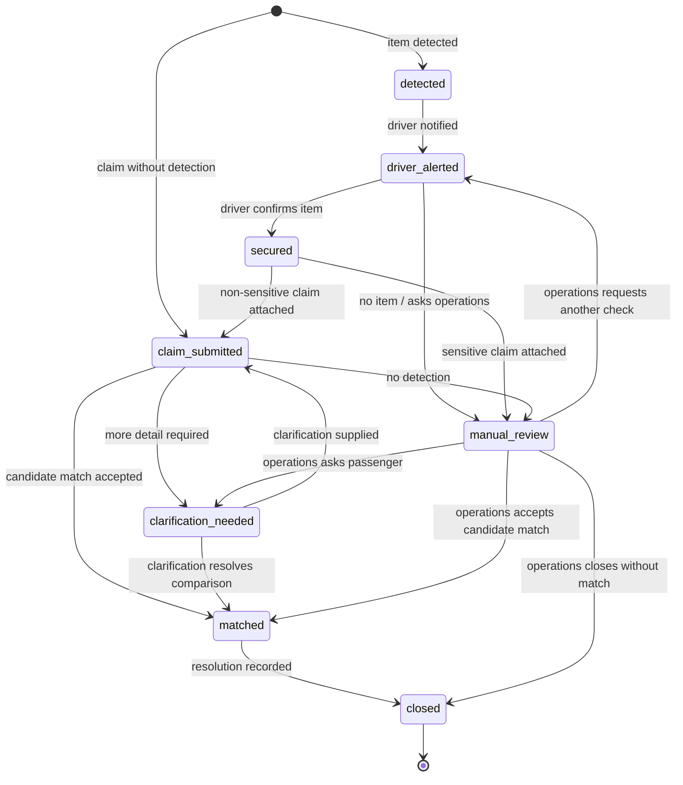

# Phase 0 Case States

The eight status values below are the shared internal vocabulary. Every transition records an audit event. Any transition out of `manual_review` requires an operations actor and a safe note.

## State diagram



## Transition rules

| From | To | Trigger | Actor | Required audit event | Manual-review reason |
| --- | --- | --- | --- | --- | --- |
| Start | `detected` | Candidate item detected | system | `case_created` | — |
| Start | `claim_submitted` | Claim received with no detected case | passenger | `claim_submitted` | — |
| `detected` | `driver_alerted` | Safe alert sent | system | `driver_alerted` | — |
| `driver_alerted` | `secured` | Driver confirms the item is secure | driver | `item_secured` | — |
| `driver_alerted` | `manual_review` | Driver reports no item | driver | `manual_review_requested` with note | `driver_reported_no_item` |
| `driver_alerted` | `manual_review` | Driver asks operations | driver | `manual_review_requested` with note | `driver_requested_help` |
| `secured` | `claim_submitted` | Non-sensitive claim attaches | system | `claim_attached` | — |
| `secured` | `manual_review` | Sensitive claim attaches | system | `manual_review_requested` with note | `sensitive_item` |
| `claim_submitted` | `clarification_needed` | Comparison needs more detail | system or operations | `clarification_requested` | — |
| `claim_submitted` | `manual_review` | No detected case exists | system | `manual_review_requested` with note | `claim_without_detection` |
| `claim_submitted` | `matched` | Candidate match accepted | system or operations | `candidate_matched` | — |
| `clarification_needed` | `claim_submitted` | Passenger supplies clarification | passenger | `clarification_submitted` | — |
| `clarification_needed` | `matched` | Clarification resolves comparison | system or operations | `candidate_matched` | — |
| `manual_review` | `driver_alerted` | Operations requests another vehicle check | operations | `driver_alerted` with note | Cleared |
| `manual_review` | `clarification_needed` | Operations requests passenger detail | operations | `clarification_requested` with note | Cleared |
| `manual_review` | `matched` | Operations accepts candidate match | operations | `candidate_matched` with note | Cleared |
| `matched` | `closed` | Resolution is recorded | operations | `case_closed` with note | — |
| `manual_review` | `closed` | Operations closes without a match | operations | `case_closed` with note | Cleared |

## Friendly labels

| Internal status | Passenger label | Driver label |
| --- | --- | --- |
| `detected` | Under review | New item detected |
| `driver_alerted` | Under review | Check vehicle |
| `secured` | Under review | Item secured |
| `claim_submitted` | Claim received | Claim received |
| `clarification_needed` | More details needed | Waiting for passenger details |
| `matched` | Possible match under review | Possible match under review |
| `manual_review` | Being reviewed by our team | Operations review needed |
| `closed` | Case closed | Case closed |

Friendly labels describe progress only. They do not confirm identity, entitlement, or return.

## Sample case walkthrough

`trip_demo_001` follows the normal path: `detected` → `driver_alerted` → `secured` → `claim_submitted` → `matched` → `closed`.

```json
{
  "caseId": "case_demo_001",
  "tripId": "trip_demo_001",
  "status": "closed",
  "createdAt": "2026-09-22T06:00:00Z",
  "updatedAt": "2026-09-22T06:25:00Z",
  "sourceType": "detection",
  "privacy": { "redactionStatus": "passed" },
  "detectedItem": {
    "category": "placeholder_bag",
    "colour": "placeholder_blue",
    "seatAreaHint": "placeholder_rear_seat",
    "confidence": null,
    "boundingBox": null,
    "noItem": false,
    "modelVersion": null
  },
  "passengerClaim": {
    "description": "Synthetic blue bag",
    "category": "placeholder_bag",
    "colour": "placeholder_blue",
    "sizeHint": "placeholder_medium",
    "language": "en",
    "sensitive": false
  },
  "manualReviewReason": null,
  "auditTimeline": [
    { "eventId": "event_demo_001", "eventType": "case_created", "occurredAt": "2026-09-22T06:00:00Z", "actorType": "system", "status": "detected", "note": "Synthetic bag candidate recorded." },
    { "eventId": "event_demo_002", "eventType": "driver_alerted", "occurredAt": "2026-09-22T06:02:00Z", "actorType": "system", "status": "driver_alerted", "note": "Safe item summary sent to driver." },
    { "eventId": "event_demo_003", "eventType": "item_secured", "occurredAt": "2026-09-22T06:08:00Z", "actorType": "driver", "status": "secured", "note": "Driver confirmed the item is secure." },
    { "eventId": "event_demo_004", "eventType": "claim_attached", "occurredAt": "2026-09-22T06:12:00Z", "actorType": "system", "status": "claim_submitted", "note": "Synthetic claim attached to the case." },
    { "eventId": "event_demo_005", "eventType": "candidate_matched", "occurredAt": "2026-09-22T06:18:00Z", "actorType": "operations", "status": "matched", "note": "Operations accepted the candidate match for the demo." },
    { "eventId": "event_demo_006", "eventType": "case_closed", "occurredAt": "2026-09-22T06:25:00Z", "actorType": "operations", "status": "closed", "note": "Synthetic resolution recorded." }
  ]
}
```

## Proposed contract changes for Student C

No stable field or status change is required. For consistent future validation, consider agreeing on these controlled values:

- Event types: `case_created`, `claim_submitted`, `driver_alerted`, `item_secured`, `claim_attached`, `clarification_requested`, `clarification_submitted`, `candidate_matched`, `manual_review_requested`, `case_closed`.
- Manual-review reasons: `driver_reported_no_item`, `driver_requested_help`, `sensitive_item`, `claim_without_detection`.

Until the team accepts that vocabulary, both fields remain strings under the current contract.
