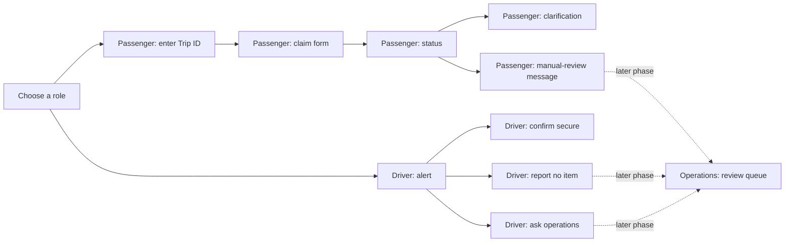

# Phase 0 Screen Map

## Data boundaries

| Screen | Reads | Safe display | Never displays |
| --- | --- | --- | --- |
| Role choice | None | Passenger and driver links | Case data |
| Passenger Trip ID | `tripId` | Synthetic Trip ID input | Cabin imagery, passenger identity, detected-item details |
| Passenger claim | `tripId` | Description, category, colour | Cabin imagery, another claim, identity data |
| Passenger status | `caseId`, `tripId`, `status`, `manualReviewReason` | Friendly status and next step | Internal confidence, bounding boxes, driver identity, entitlement language |
| Passenger clarification | `caseId`, `status`, `passengerClaim` | A request for safe descriptive detail | Detected-item evidence or comparison score |
| Passenger manual review | `caseId`, `status` | A neutral review message | Internal reason codes, staff notes, outcome promises |
| Driver alert | `caseId`, `status`, safe `detectedItem` fields | Category, colour, seat-area hint | Cabin imagery, passenger claim, passenger identity, confidence, bounding box |
| Driver action result | `caseId`, `status`, `auditTimeline`, `manualReviewReason` | Resulting status and new safe audit event | Passenger identity or claim description |
| Operations review queue | Future safe case summary | Not implemented in Phase 0 | Raw or unredacted material by default |

The static passenger and driver pages use separate in-memory copies of the mock records. They demonstrate the agreed journey; they do not synchronize state or call the API.
